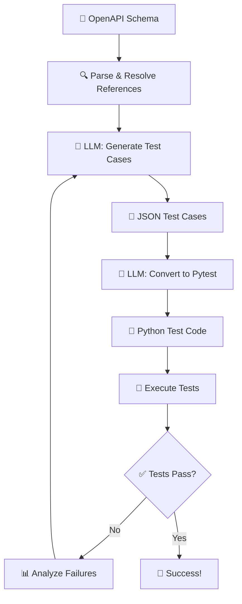

# 🤖 AI-Generated API Tests

🚀 Automated API test generation using LLM and OpenAPI schemas.

## 📋 Overview

This project automatically generates pytest test cases from OpenAPI specifications using a local LLM. It creates comprehensive API tests by analyzing schema definitions and generating realistic test data.

## 🔄 Workflow Diagram

```
📄 OpenAPI Schema → 🧠 LLM Analysis → 📝 Test Cases → 🐍 Pytest Code → ✅ Test Execution
      ↓                    ↓                ↓              ↓               ↓
  parse_openapi.py    test_agent_new.py   JSON format   Python code    Pass/Fail
```

## ⚡ Features

- 📊 Parses OpenAPI JSON schemas
- 🎯 Generates test cases with realistic payloads
- 🐍 Creates pytest code automatically
- ✅ Validates API responses against expected status codes
- 🔄 Iterative test improvement cycle

## 🛠️ Setup

### 1️⃣ Start your FastAPI server:
```bash
cd MyApi
uvicorn main:app --reload
```

### 2️⃣ Start local LLM (Ollama):
```bash
ollama serve
ollama pull llama3
```

### 3️⃣ Run test generation:
```bash
python test_agent_new.py
```

## 🏗️ Architecture

```
┌─────────────────┐    ┌─────────────────┐    ┌─────────────────┐
│   📄 OpenAPI    │───▶│   🧠 TestAgent  │───▶│   🧪 Pytest    │
│     Schema      │    │      (LLM)      │    │     Tests       │
└─────────────────┘    └─────────────────┘    └─────────────────┘
         │                       │                       │
         ▼                       ▼                       ▼
  ┌─────────────┐      ┌─────────────────┐      ┌─────────────┐
  │ Schema      │      │ 1. Parse Schema │      │ Execute &   │
  │ Validation  │      │ 2. Generate     │      │ Validate    │
  │             │      │    Test Cases   │      │ Results     │
  └─────────────┘      │ 3. Create Code  │      └─────────────┘
                       └─────────────────┘
```

## 📁 Files

| File | Description | Role |
|------|-------------|------|
| 🤖 `test_agent_new.py` | Main test generation agent | 🧠 Orchestrator |
| 📊 `parse_openapi.py` | OpenAPI schema parser with reference resolution | 🔍 Parser |
| 📄 `openapi.json` | API specification | 📋 Schema |
| 🚀 `MyApi/main.py` | Sample FastAPI application | 🎯 Target API |
| 🧪 `test_api.py` | Generated test file (auto-created) | ✅ Tests |

## 🔧 Requirements

- 🐍 Python 3.8+
- ⚡ FastAPI
- 🧠 Ollama with llama3 model
- 📡 requests
- 🧪 pytest

## 🎯 Test Generation Process



## 🚀 Quick Start

1. 📥 Clone the repository
2. 🔧 Install dependencies: `pip install -r requirements.txt`
3. 🧠 Setup Ollama: `ollama pull llama3`
4. 🚀 Start API: `cd MyApi && uvicorn main:app --reload`
5. 🤖 Generate tests: `python test_agent_new.py`
6. 🧪 Watch the magic happen! ✨